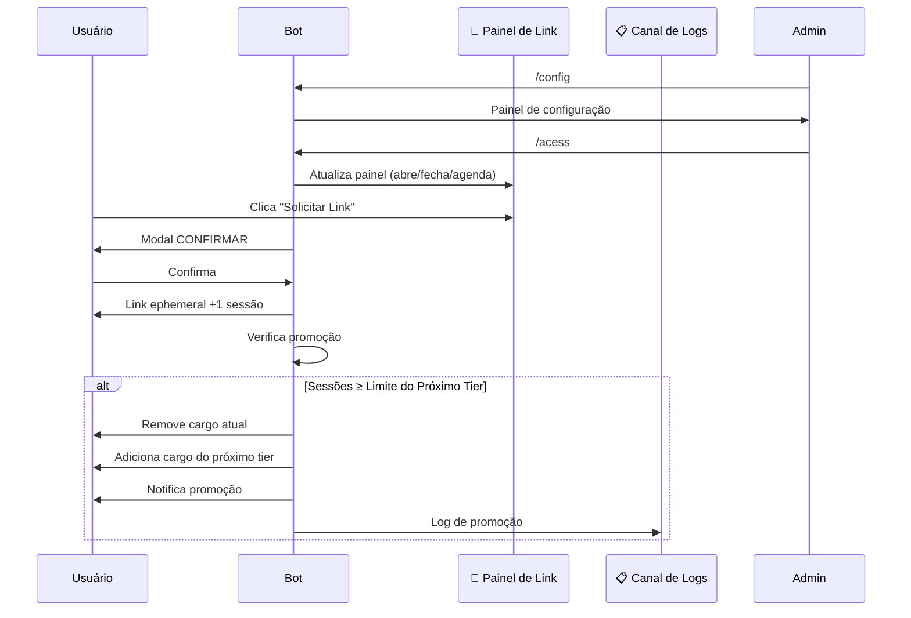

markdown
<p align="center">
  
</p>

<p align="center">
  
  
  
  
  
</p>

<br>

<h1 align="center"> 𝙰𝚜𝚌𝚎𝚗𝚍 𝚂𝚢𝚜𝚝𝚎𝚖 • 𝙱𝙾𝚃</h1>

<p align="center">
  Sistema completo de progressão por Tiers com sessões aos sábados, cargos automáticos e integração com Vehix.
</p>

<p align="center">
  <b>𝙼𝚊𝚍𝚎 𝙱𝚢 𝚈𝟸𝚔_𝙽𝚊𝚝</b>
</p>

---

## ✦ 𝙰𝙱𝙾𝚄𝚃

> O **Ascend System** é um sistema profissional de progressão por Tiers criado em **Node.js + discord.js v14**. Ele permite que membros evoluam de tier participando de sessões aos sábados, com cargos automáticos, contagem regressiva, dias extras e painel de link integrado. Totalmente configurável via `/config` e `/acess`.

---

## ✦ 𝙵𝙴𝙰𝚃𝚄𝚁𝙴𝚂

```txt
🏆 TIERS              → 5 tiers configuráveis via .env com cargos automáticos
📅 SESSÕES            → Sábados automáticos + dias extras + controle manual
🕐 HORÁRIO            → Configurável com contagem regressiva (timestamp)
🔗 PAINEL DE LINK     → Embed premium com botão, atualização automática
⏰ COUNTDOWN          → Temporizador regressivo até o horário da sessão
📊 RANKING            → Top 10 membros por tier e sessões
👤 PERFIL             → /mytier com progresso, barra e histórico
🎉 PROMOÇÃO           → Automática, com mensagem personalizada por tier
💾 BACKUP             → Automático a cada 6 horas (mantém últimos 5)
📝 LOGS               → Canal de logs com eventos detalhados
🔄 SINCRONIZAÇÃO      → Membros sincronizados a cada 1 hora
🛡 CONTROLE TOTAL     → /acess para abrir/fechar/cancelar sessões
📂 ORGANIZAÇÃO        → 2 arquivos JSON por servidor (config + users)
🔌 INTEGRAÇÃO         → Compatível com Vehix para limite de preços
```

---

✦ 𝚂𝚈𝚂𝚃𝙴𝙼 𝙵𝙻𝙾𝚆



---

✦ 𝙲𝙾𝙼𝙼𝙰𝙽𝙳𝚂

🤖 Slash Commands

```
/mytier
  └─ Exibe seu perfil completo, tier, progresso e ranking

/config
  └─ Abre o painel de configuração do sistema (Apenas Owner)

/acess
  └─ Controla a sessão manualmente ou agenda data/hora
     • /acess → Alterna abrir/fechar/cancelar
     • /acess data:2024-12-25 → Agenda dia extra
     • /acess hora:14:00 → Define horário da sessão
```

---

💬 Comandos de Prefixo ($)

```
📊 Informações
  $ping              → Latência do bot
  $tier [@usuário]   → Ver tier de um usuário
  $sessoes [@user]   → Ver quantidade de sessões
  $ranking           → Top 10 do servidor
  $info              → Informações do sistema
  $help              → Central de ajuda

🔗 Sessão
  $link              → Solicitar link rápido (atalho)

👑 Owner
  $backup            → Criar backup manual
```

---

✦ 𝙿𝙴𝚁𝙼𝙸𝚂𝚂𝙸𝙾𝙽𝚂

```txt
👑 DONO DO BOT (OWNER_ID)
   ✔ Usar /config para configurar tudo
   ✔ Usar /acess para controlar sessões
   ✔ Usar $backup para backup manual
   ✔ Todas as ações administrativas

👤 USUÁRIOS COMUNS
   ✔ Usar /mytier para ver seu progresso
   ✔ Clicar no botão "Solicitar Link"
   ✔ Usar $tier, $sessoes, $ranking, $link
   ✔ Votar e participar das sessões
```

---

✦ 𝚂𝙴𝚃𝚄𝙿

Pré-requisitos

· Node.js 16.9.0 ou superior
· Token de bot Discord
· ID do dono do bot
· IDs dos cargos (Tier 1 a Tier 5)

---

✦ 𝙳𝙰𝚃𝙰𝙱𝙰𝚂𝙴

```
data/
└── guilds/
    └── {guildId}/
        ├── config.json    → Configurações do servidor (tiers, link, sessões)
        ├── users.json     → Dados dos usuários (tier, sessões, joins)
        ├── sessions.json  → Contagem de sessões por usuário
        ├── joins.json     → Histórico de joins (data, hora, tier)
        └── backups/       → Backups automáticos (mantém últimos 5)

backups/
└── {guildId}/
    └── backup_YYYY-MM-DD_HH-MM-SS/
        ├── config.json
        ├── users.json
        ├── sessions.json
        └── joins.json
```

✔ Leve
✔ Persistente
✔ Organizado por servidor
✔ Fácil manutenção
✔ Backups automáticos

---

✦ 𝙾𝙱𝙹𝙴𝙲𝚃𝙸𝚅𝙴

```
✔ Automatizar a progressão de membros
✔ Recompensar a participação nas sessões
✔ Criar um sistema justo de evolução
✔ Integrar com outros bots (Vehix)
✔ Facilitar a gestão de cargos
✔ Oferecer experiência premium aos usuários
```

---

✦ 𝙻𝙸𝙲𝙴𝙽𝚂𝙴

Este projeto está licenciado sob a licença MIT. Veja o arquivo LICENSE para mais detalhes.

---

✦ 𝚂𝚄𝙿𝙿𝙾𝚁𝚃

Encontrou um bug? Tem uma sugestão? Entre em contato com o desenvolvedor:

· Discord: y2k_nat

· Email: ornelasisac13@gmail.com

---

<p align="center">
  <b>📌 Status: 🟢 Online • ⚡ Estável • 🔒 Seguro</b>
</p>

<p align="center">
  <b>© 2026 Ascend System • 𝙼𝚊𝚍𝚎 𝙱𝚢 𝚈𝟸𝚔_𝙽𝚊𝚝</b>
</p>

---